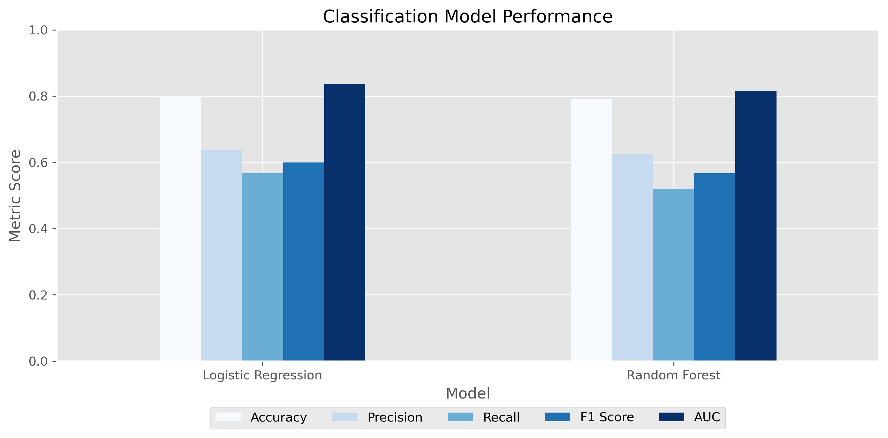
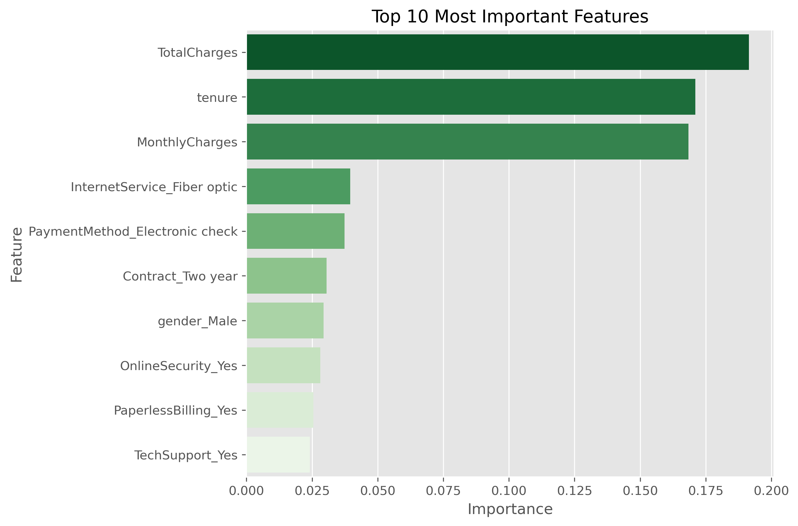
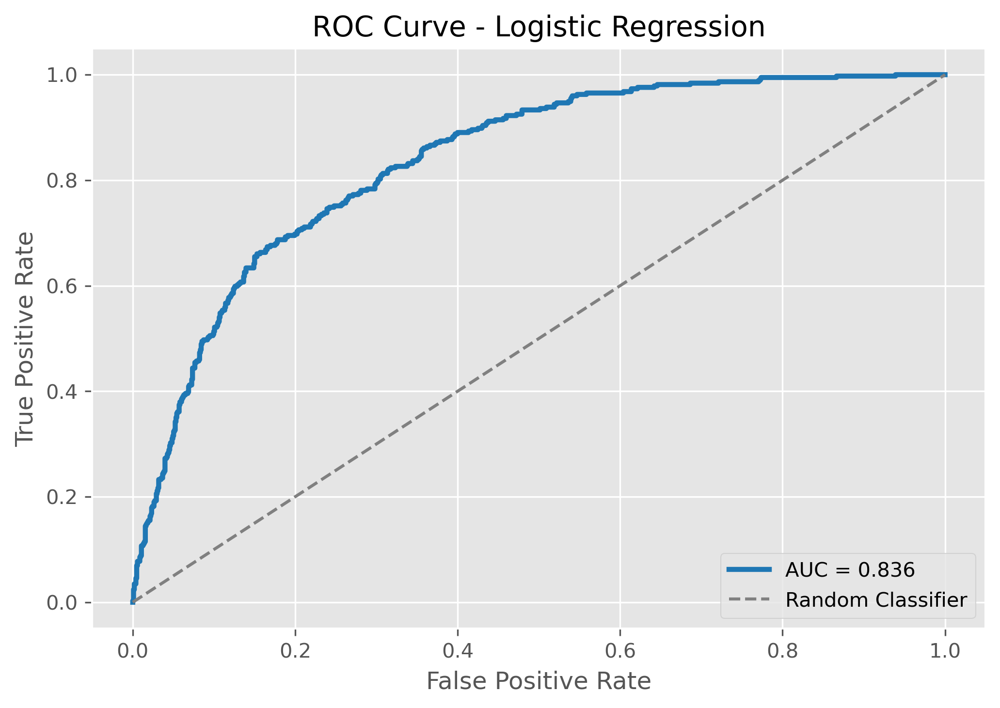

# 📊 Customer Churn Analysis & Prediction

A complete end-to-end Machine Learning project focused on analyzing customer churn and building predictive models to identify customers at risk of leaving a telecommunications company.

This project combines Exploratory Data Analysis (EDA), data preprocessing, feature engineering, predictive modeling, and business interpretation to generate actionable insights for customer retention.

---
## 📊 Model Performance Comparison



---

## ⭐ Feature Importance



---

## 📈 ROC Curve



---

## 🎯 Project Objectives

The main goals of this project are:

- Perform a complete Exploratory Data Analysis (EDA).
- Identify the main factors influencing customer churn.
- Prepare the dataset for Machine Learning.
- Train and evaluate predictive classification models.
- Compare different algorithms.
- Translate model results into business insights.

---

## 📂 Dataset

The dataset contains customer information from a telecommunications company, including:

- Customer demographics
- Contract information
- Internet services
- Additional services
- Payment methods
- Monthly and total charges
- Customer tenure
- Churn status

Target variable:

- **Churn**
  - Yes = Customer left
  - No = Customer stayed

---

## 🛠 Technologies Used

- Python
- Pandas
- NumPy
- Matplotlib
- Seaborn
- Scikit-Learn
- Jupyter Notebook

---

## 📈 Exploratory Data Analysis

The EDA explored relationships between customer churn and several business variables, including:

- Contract type
- Customer tenure
- Monthly charges
- Internet service
- Online Security
- Tech Support
- Payment method
- Senior Citizen status

Multiple visualizations and business insights were generated for each feature.

---

## 🤖 Machine Learning Pipeline

The project follows a complete Machine Learning workflow:

1. Data Cleaning
2. Feature Engineering
3. One-Hot Encoding
4. Train/Test Split
5. Logistic Regression (Baseline)
6. Random Forest Classifier
7. Model Evaluation
8. Feature Importance Analysis
9. Business Interpretation

---

## 📊 Models Compared

### Logistic Regression

- Baseline classification model
- Simple and highly interpretable
- Excellent benchmark performance

### Random Forest

- Ensemble learning model
- Captures non-linear relationships
- Provides feature importance rankings

---

## 📈 Evaluation Metrics

Models were evaluated using:

- Accuracy
- Precision
- Recall
- F1 Score
- ROC Curve
- AUC Score
- Confusion Matrix

---

## ⭐ Key Business Insights

The analysis revealed several important drivers of customer churn:

- Customers with month-to-month contracts are significantly more likely to churn.
- Short-tenure customers have the highest churn risk.
- Higher monthly charges are associated with increased churn.
- Fiber optic customers churn more frequently than DSL customers.
- Customers without Online Security and Tech Support are considerably more likely to leave.
- Automatic payment methods are associated with lower churn.
- Senior citizens present higher churn rates.

These findings can support customer retention strategies by identifying high-risk customer segments before they leave.

---

## 📁 Project Structure

```text
Project_02_Customer_Churn/
│
├── data/
│
├── images/
│   ├── feature_importance.png
│   ├── model_comparison.png
│   └── roc_curve.png
│
├── notebooks/
│   └── 02_customer_churn_analysis.ipynb
│
├── reports/
│
├── src/
│
├── requirements.txt
├── README.md
└── .gitignore

---

## 🚀 Future Improvements

Possible extensions of this project include:

- Hyperparameter tuning with GridSearchCV
- Cross-validation
- Feature selection techniques
- XGBoost implementation
- LightGBM implementation
- Interactive Power BI dashboard
- Model deployment with Streamlit or Flask

---

## 👤 Author

**Martin Panelo**

Geoscientist transitioning into Data Analytics and Machine Learning.

- LinkedIn: https://www.linkedin.com/in/martinpanelo/
- GitHub: https://github.com/PaneloMartin

---

⭐ If you found this project interesting, feel free to explore the notebook and connect with me on LinkedIn.